# Collaboration patterns among Italian musicians
## Gender homophily and musical genre on Discogs

This report was generated automatically at an earlier stage of the analysis
and has not been revised since. Its interpretation of the time series (a
reversal of sign) was later withdrawn; the current results are in
`docs/06-risultati.md` and in the manuscript. The figures below are recomputed
from the current data files, but the surrounding text may no longer match
them.

*Analysis run on 26 September 2026. Single source: a local Discogs dump (PostgreSQL).*

---

## Summary for the busy reader

This study reconstructs **who recorded with whom** among the Italian musicians
listed on Discogs and asks whether people's gender structures those
collaborations. The short answer is yes, but not in the way one would expect.
Homophily exists and is statistically very solid, but it is much weaker than
the separation by musical genre; it is **asymmetric** (it is women who cluster
together, not men, the opposite of what the current literature reports); and
it did not strengthen after 2000: what strengthened is the network's tendency
to **close into triangles**, which produces the same apparent effect for a
different reason.

### The numbers

| | |
|---|---|
| Italian musicians identified | **87,229** |
| of whom with determined gender | 65,093 (74.6%) |
| Share of women among those with determined gender | **14.8%** (a ratio of **5.77 men for every woman**) |
| Credits analyzed | 3,682,616, of which 2,360,057 (64.1%) resolved to the individual track |
| Collaboration network | 70,712 connected artists, 586,040 ties |
| Giant component | 95.4% of connected artists |
| Gender assortativity | **r = 0.0432** (95% CI 0.0399–0.0465) |
| Musical-genre assortativity | **r = 0.4970** |
| Gender homophily pre-2000 → post-2000 | 0.0406 → 0.0693 (difference not significant in the ERGM) |
| ERGM homophily, women vs. men (median across subnetworks) | **0.679 vs. 0.074** in log-odds |
| ERGM | 8 subnetworks, 3 models each, **8 converged**, `gwesp` included |

### The five things to know

1. **Italian recorded music is a men's world, and it has remained one.**
   A share of 14.8% women among artists with determined gender
   means 5.8 men for every woman. The share does not grow
   monotonically over time: it starts at 17.8% for those who
   debuted in the 1960s, falls to 13.2% in the 1980s and rises
   again to 21.4% for those who debuted from 2020 onward.

2. **Musical genre separates far more than gender does.** Assortativity by
   musical genre (0.497) is about
   12 times that by gender
   (0.043). Jazz musicians record with jazz musicians far more
   systematically than men record with men.

3. **Gender homophily is small but real.** r = 0.0432 looks small,
   but the degree-preserving null model gives 0.0001 and the
   confidence interval (0.0399–0.0465) lies entirely
   above zero. It is not a composition effect; it is structure.

4. **It is women who cluster together, not men.** This is the result that
   most clearly contradicts expectations. In the ERGM, which holds activity,
   cohort, musical genre and triadic closure constant, the female homophily
   coefficient is positive and large in **all eight** estimated subnetworks;
   the male coefficient is close to zero, and in Rock it is even negative.
   Where a group is an overwhelming majority it has no need to seek itself
   out; where it is rare, it clusters.

5. **After 2000 it is not homophily that increases, but closure into
   triangles.** Descriptively, assortativity rises from 0.0406
   to 0.0693. But in the ERGM the difference between the two
   periods in the gender terms is **not significant** (p =
   0.88 for women, 0.60 for men),
   while the triadic closure term grows from 2.22
   to 2.89 with p < 0.0001. The criterion by which
   a collaborator is chosen has not changed: the shape of the network has.

6. **The "Smurfette" pattern is not observed.** Holding releases, cohort and
   musical genre constant, being a woman does not shift network position on
   any of the three centrality measures used (section 6.2). The inequality is
   large, but it lies in **access** and in the volume of activity, not in the
   position of those who managed to get in.

> **Measurement note.** All gender assortativities reported as main results
> are computed only on edges where **both** artists have a determined gender
> (80.3% of edges). Including `unknown` as a fourth
> category systematically inflates the index, because poorly documented
> artists collaborate with each other more than chance would predict, for
> reasons of data coverage. The two measures are compared in a table in
> section 5.1.

### How far to trust these results

Gender does not appear in any source: it is **inferred**. A determination is
reached for 74.6% of the population, with
5,203 cases anchored to Wikidata through the Discogs identifier
(exact join, no homonymy) and the rest inferred from first names. The manual
validation sample of 200 cases and the tool for measuring
the error are ready in `data/validation_sample.csv`; until the sample is
coded by hand, the figures above should be read as estimates with an error
that has not yet been quantified. The Monte Carlo analysis in section 8.1
nonetheless shows that homophily remains positive **in every imputation
scenario**, including the one built specifically to minimize it.

---


# 1. Data sources: what is there, what is missing, what had to be built

## 1.1 The source

The analysis uses **a single source**: a local copy of the Discogs dump in
PostgreSQL (database `discogs`, 248,153,636 rows in the tables used).
The initial design also included a second database, iTunes, and a bridge
table between the two; at the client's request iTunes was **excluded**. The
methodological consequence is clear-cut and must be stated: there is no
independent cross-check of the artist records, and the robustness axis "union
of sources vs. Discogs only" no longer applies. In its place, two alternative
axes were introduced (the Italian-share threshold and the use or non-use of
track-level credits), discussed in section 8.2.

All database sessions ran with `default_transaction_read_only = on`. In
PostgreSQL this setting also forbids temporary tables, so the extraction was
rewritten to create **no** objects on the server: lists of identifiers
computed in Python are sent back to the database as `int[]` literals. No write
of any kind touched the source.

## 1.2 Three gaps that changed the design

Exploration found three gaps in the dump that forced deviations from the
original plan. They need to be stated clearly because they limit what can be
concluded.

**`release_label` is empty (0 rows).** There is no link between releases and
record labels. The planned heuristic for identifying Italian musicians through
*Italian labels* therefore cannot be applied, and with it goes any analysis by
record company. Italian identity therefore rests on the country of release
alone.

**`release_genre` and `release_style` are empty (0 rows).** Musical genre is
available only through the *master* (`master_genre`), and masters cover about
59% of releases. This is why 26.9% of the population has
no musical genre assigned.

**The "Various Artists" entity is effectively absent.** In the whole of
`release_artist` (over 92 million rows) there are **328** main credits
attributed to an artist named "Various*". In this dump compilations do not use
the usual placeholder: they list the artists directly. The `exclude_various`
filter is therefore almost inert (3 releases caught), and
compilations have to be recognized by a different criterion, the presence of
several distinct main artists, which is the `exclude_compilations` filter used
as a robustness axis.

## 1.3 Who counts as an "Italian musician"

Without label data and without a nationality field, Italian identity was
defined by the **share of Italian releases** in each artist's career:

> An artist enters the population if they have at least 2 releases
> with `country = 'Italy'`, at least 3 releases in total, and if
> the Italian ones make up at least 50% of the total.

The share rule is the part that does the work. The absolute count alone
produces a list dominated by Beethoven, Mozart, Bach, Chopin and Karajan: the
classical repertoire is reissued in Italy in large quantities, and counting
only "how many Italian releases" mistakes the catalog for the biography. The
share excludes all of them, because for each of them the Italian editions are
a tiny fraction of a worldwide catalog.

The validity check consisted of inspecting the top twenty-five artists by
volume: Mina, Lucio Battisti, Vasco Rossi, Fabrizio De André, Franco Battiato,
Lucio Dalla, Mogol, Renato Zero, Francesco De Gregori, Domenico Modugno,
Claudio Villa, plus a group of Italian producers and engineers who are
genuinely active (Antonio Baglio, Giovanni Versari, Vincenzo Tempera). No
evident false positives.

Two structural limits remain that no threshold can remove:

* the rule measures **where people release**, not **where they come from**. A
  foreign musician who has worked almost exclusively for the Italian market
  enters the population; an Italian emigrant who releases mostly abroad drops
  out. The 50% threshold keeps the first error low at the
  cost of increasing the second;
* Discogs is not a census. It overrepresents vinyl, collecting and electronic
  music, and underrepresents music that was never released on a cataloged
  physical format. The composition by musical genre in section 3.2 should be
  read as the composition *of the Discogs catalog*, not of Italian music.

**Effect of the threshold** (measured): 254,286 artists have at
least two Italian releases; applying the share and the minimum, the population
falls to **87,229**. Raising the share to 0.60 and 0.70 gives
78,448 and 66,113 artists: section 8.2 shows that the
conclusions do not change.


# 2. Gender: how it was inferred

## 2.1 The problem

None of the available sources records people's gender. It has to be inferred,
and the inference must be documented in full, because it is the most fragile
point of the whole study: every conclusion about gender homophily rests on a
label that nobody declared.

The cascade proceeds from the strongest signal to the weakest, and each artist
carries **which level** their label comes from and **with what confidence**.

## 2.2 Level 1: Wikidata linked to the Discogs identifier

Wikidata exposes property `P1953`, *Discogs artist ID*. This allows an **exact
join on the identifier**, not on the name: no homonymy, no approximate
matching. All entities with `P1953` and `P21` (sex or gender) were collected:
**202,478 distinct Discogs identifiers**, with
74 ambiguous cases discarded and **zero blocks lost** in
a recursive pagination by identifier prefix.

Of these, **5,203 fall within our population**
(6.0%). This is low coverage in absolute terms,
and the reason is obvious: Wikidata describes notable people, while the
Discogs population consists largely of session musicians, arrangers, sound
engineers and producers who have no encyclopedia entry. But these are
5,203 **certain** labels, and the next level rests on them.

## 2.3 Level 2: first names, learned from the data rather than taken from a list

The design called for the ISTAT list of first names. In this environment it
was not available as a downloadable dataset; the fallback adopted is better
for the purpose, not worse.

The same 202,478 Discogs identifiers labeled by Wikidata were
joined back to the **names** in the database: this yields
**199,812 name→gender pairs for musicians**, a domain-specific
corpus of first names, much larger than the Italians alone and much more
relevant than a generic civil-registry list.

Two dictionaries are derived from it, and the order in which they are
consulted is the most important methodological choice in this section:

1. **Italian dictionary** (320 names), built only on the
   Italian artists labeled by Wikidata;
2. **`gender-guesser` with the Italian lookup**;
3. **global dictionary** (2,204 names), but **only for names
   that the Italian lookup does not recognize**;
4. global `gender-guesser`, as a last resort and with reduced confidence.

The constraint in point 3 is not pedantry. Andrea, Simone, Nicola, Daniele,
Michele and Gabriele are male names in Italy and female names in
English-dominated dictionaries: using the global dictionary without that
filter would flip the gender of some of the most common Italian male first
names, a systematic rather than random error, concentrated precisely on the
most frequent names. Checked against the data: the two dictionaries agree on
all 241 names they have in common, which indicates that
the filter is actually keeping the two domains apart rather than masking a
conflict.

## 2.4 Level 3: groups are read from their members

A band name says nothing about the gender of its members. For groups,
therefore, the membership is examined (`group_member`): if the members of
known gender include both genders the group is **`mixed`**, if they are all of
the same gender the group inherits it, and if fewer than two are known it
remains `unknown`. **0 of 0 groups**
were resolved, of which 0 are mixed.

## 2.5 Outcome of the cascade

| source                         | artists   | share   |
|:-------------------------------|:----------|:--------|
| onomastico_prior_it            | 44,618    | 51.2%   |
| none                           | 22,136    | 25.4%   |
| onomastico_prior_globale       | 6,217     | 7.1%    |
| wikidata_p1953                 | 5,203     | 6.0%    |
| onomastico_gg_it_male          | 3,196     | 3.7%    |
| onomastico_gg_it_female        | 2,262     | 2.6%    |
| wikidata_name                  | 1,500     | 1.7%    |
| onomastico_gg_globale_male     | 1,162     | 1.3%    |
| onomastico_gg_globale_female   | 863       | 1.0%    |
| onomastico_gg_it_mostly_male   | 44        | 0.1%    |
| onomastico_gg_it_mostly_female | 28        | 0.0%    |

**Table: Source of the gender label for each artist.** The
`onomastico_prior_it` row carries most of the load on its own: it is the
dictionary built on the 5,203 certain Italians, and
320 first names are enough to cover almost half of the
population, because Italian first names are highly concentrated. `none` and
`group_unresolved` are the two faces of not knowing: artists whose name is not
a recognizable personal name (acronyms, pseudonyms, projects) and groups for
which not enough members are known.

**Final outcome: 14.8% women among artists with determined
gender**, that is, 5.77 men for every woman, with
25.4% of the population remaining undetermined.

## 2.6 The missing piece: manual validation

`data/validation_sample.csv` has been generated: **200
artists** drawn with stratification by gender, confidence band and label
source, with an empty `human_gender` column to be filled in by hand. The
script `src/score_validation.py` computes precision, recall, F1 and the
confusion matrix by cascade level as soon as the file is filled in.

The sample uses **half proportional and half uniform allocation** across
strata: the proportional part makes it possible to estimate overall accuracy
without reweighting, and the uniform part guarantees enough cases even in the
rare levels of the cascade. Within each stratum, distinct first names are
favored, because otherwise small strata fill up with people who share a name
and the validation would measure accuracy on one name rather than on a level.

On two levels that remedy is not enough, and this should be said:
`onomastico_gg_mostly_female` contains 28 artists who share **a single** first
name (Mary), and `onomastico_gg_mostly_male` contains 44 with two (Toni,
Leonida). On those two levels the validation will be able to say whether those
names are classified correctly, not whether the level works in general.
Together they account for 72 of 87,229 artists, so this does not
affect the conclusions, but the resulting accuracy figure should not be read
as generalizable.

This step **has not been carried out**: it requires human judgment. Until it
is completed, the error of the gender inference is bounded only by the Monte
Carlo analysis in section 8.1, which, however, measures the effect of
*uncertainty about the unknowns*, not that of *errors among the knowns*. This
is the most serious limitation of the study.


# 3. The network: how two musicians become connected

## 3.1 Edge weight, and why not all credits count the same

A Discogs credit can say three very different things. It can say *"this
person plays bass on track B2"*; it can say *"this person is the artist of the
record"*; it can say *"this person appears in the credits of the record"*,
without specifying where. Treating them as equivalent would mean giving a
shared sleeve credit the same value as a documented session.

Each credit therefore receives a **specificity**, and the weight of the tie
between two artists uses it:

| scope | specificity | what it means |
|---|---|---|
| `track` | 1.00 | credit resolved to a specific track |
| `main` | 0.70 | main artist of the release |
| `umbrella` | 0.30 | secondary credit, with no indication of tracks |

$$w(u,v) = w_t \cdot |\text{shared tracks}| + w_r \cdot \sum_{R} s_u(R)\, s_v(R)$$

The first term rewards collaboration **documented on the same track**; the
second retains co-presence on the same release, scaled by the specificity of
both credits. Two session musicians credited on the same track weigh much more
than two names that appear generically on the same record.

Track-level credits come from two routes. The first is `release_track_artist`,
which carries a global track identifier: **1,932,237 credits**. The
second is the `tracks` field of `release_artist`, which gives positions in
text form (`A1`, `1 to 3`, `4, 6, 12`) and has to be **resolved**: positions
are converted into actual tracks through `release_track`. Of
442,050 positional credits, 427,820
(96.8%) were resolved; the rest
use free-form expressions (*"all tracks except 1, 13 and 14"*) and were
**downgraded to `umbrella`** rather than forced into an interpretation.

Total: **2,360,057 of 3,682,616 credits
(64.1%) are resolved at the level of the individual track.**

## 3.2 Filters and subnetworks

Releases with more than 8 credited artists are discarded:
they are compilations and box sets, where co-presence does not indicate
collaboration and the number of pairs grows quadratically. The filter reduces
the credits from 3,682,616 to 586,040.

The role subnetworks separate two different trades: **creative** (production,
writing, arrangement, composition) and **performance** (vocals, instruments,
conducting, featuring). A main artist without an explicit role is treated as a
performer, because that is what being the artist of a record means.

| network     | total nodes   | nodes with edges   | edges   | density   | mean degree   | median degree   | max degree   | components   | giant component   | giant component share   | total weight     |
|:------------|:--------------|:-------------------|:--------|:----------|:--------------|:----------------|:-------------|:-------------|:------------------|:------------------------|:-----------------|
| all         | 87,229        | 70,712             | 586,040 | 0.000234  | 16.575404     | 7.000000        | 2,258        | 1,204        | 67,443            | 0.953770                | 1,495,529.570002 |
| creative    | 87,229        | 30,440             | 199,832 | 0.000431  | 13.129566     | 4.000000        | 1,348        | 1,530        | 26,538            | 0.871813                | 866,621.310000   |
| performance | 87,229        | 49,152             | 211,751 | 0.000175  | 8.616170      | 4.000000        | 598          | 2,493        | 42,013            | 0.854757                | 430,596.670000   |

**Table: Descriptive statistics of the three collaboration networks**

*Full data in `tables/t2_rete_descrittive.csv` and `tables/t2_rete_descrittive.tex`.*


The overall network is **sparse and highly connected**: density on the order
of 0.000234, but a giant component that absorbs 95.4%
of the connected artists. This is the typical signature of a professional
world in which almost nobody works in isolation and almost nobody works with
everyone. The `creative` network is smaller and denser than the `performance`
network: producers and songwriters form a tighter and more interwoven core
than performers, which matters for the reading of section 5.3, where the two
roles show different levels of homophily.

<figure>
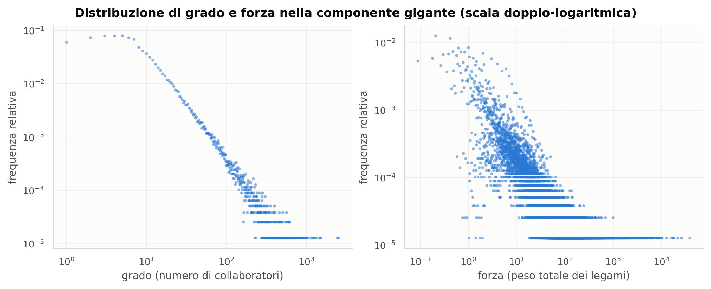
<figcaption>

**Degree and strength distributions.** On a log-log scale both distributions decline along an almost straight line over several orders of magnitude: the vast majority of artists have very few collaborators, while a thin minority have hundreds. Strength, which sums the weights and therefore counts how many times people collaborated and how specific the credits were, has an even longer tail than degree: the major collaborators do not just have many partners, they have much more intense relationships. This is the structural background against which section 6.1 should be read: in a network this unequal, the question 'are women at the center?' must always be asked holding activity constant, because the number of releases alone already explains much of centrality.

</figcaption>
</figure>


The analyses that follow run on the **giant component**, because centrality
measures and distances are not defined across separate components. The
excluded share is 4.6% of the connected artists.


# 4. How many women there are, and in which music (RQ1)

<figure>
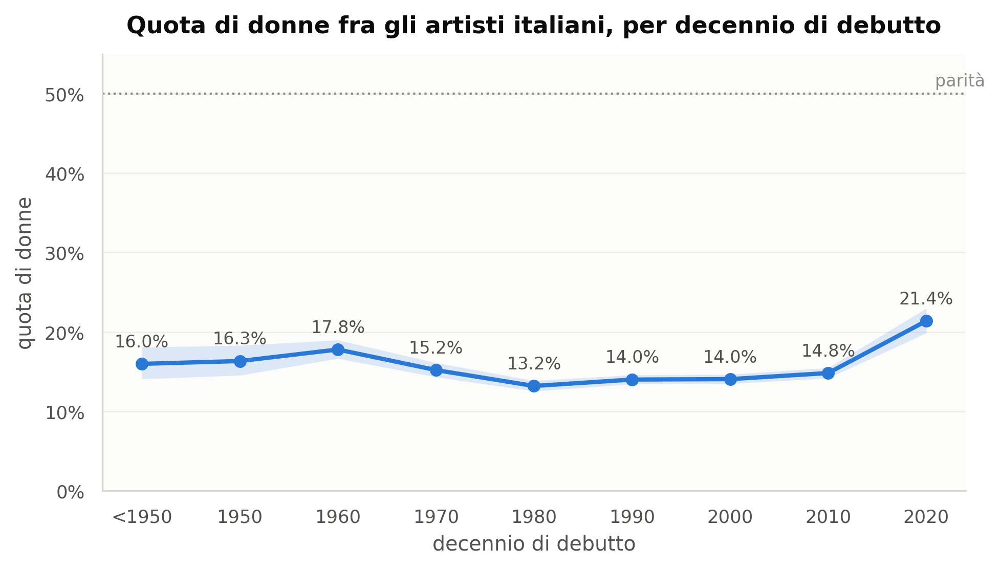
<figcaption>

**The share of women by decade of debut.** The line is not a story of progress. It starts at 17.8% for those who debuted in the 1960s, falls to 13.2% in the 1980s (the lowest point in the series) and rises only recently, to 21.4% for those who debuted from 2020 onward. The decline of the 1970s and 1980s calls for caution before it is read as a real setback: it coincides with the massive expansion of the Discogs catalog for those years, that is, with the mass entry of technical and production credits (trades that are almost entirely male), which dilute a share computed over all credits rather than over performers only. The recent rise, by contrast, is consistent in both magnitude and direction with what is observed in other music catalogs. In every decade, however, the confidence band remains very far from parity.

</figcaption>
</figure>


<figure>
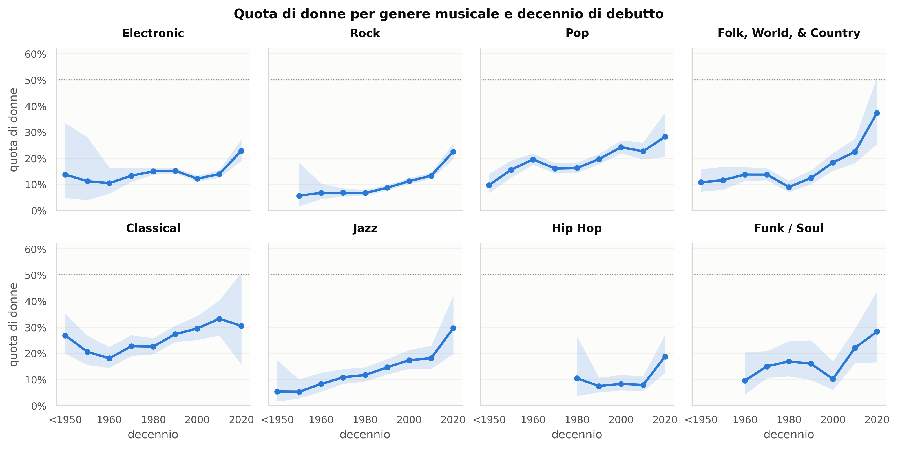
<figcaption>

**Share of women by musical genre and decade.** The panels show that there is no single trajectory of gender representation: there are musical genres with different histories. The starting level matters more than the slope: a genre that starts low tends to stay low across the decades, which is exactly the signature of a segregation that reproduces itself through recruitment rather than dissolving over time.

</figcaption>
</figure>


| musical genre    | debut decade   | artists   | gender known   | women   | share of women   | ci_lo   | ci_hi   | men per woman   |
|:-----------------|:---------------|:----------|:---------------|:--------|:-----------------|:--------|:--------|:----------------|
| Blues            | 1940           | 1         | 1.000          | 0.000   | 0.000            | 0.000   | 0.793   | n/a             |
| Blues            | 1950           | 3         | 0.000          | 0.000   | n/a              | n/a     | n/a     | n/a             |
| Blues            | 1960           | 17        | 13.000         | 1.000   | 0.077            | 0.014   | 0.333   | 12.000          |
| Blues            | 1970           | 61        | 54.000         | 9.000   | 0.167            | 0.090   | 0.287   | 5.000           |
| Blues            | 1980           | 105       | 98.000         | 15.000  | 0.153            | 0.095   | 0.237   | 5.533           |
| Blues            | 1990           | 129       | 106.000        | 15.000  | 0.142            | 0.088   | 0.220   | 6.067           |
| Blues            | 2000           | 137       | 121.000        | 21.000  | 0.174            | 0.116   | 0.251   | 4.762           |
| Blues            | 2010           | 141       | 114.000        | 22.000  | 0.193            | 0.131   | 0.275   | 4.182           |
| Blues            | 2020           | 22        | 17.000         | 4.000   | 0.235            | 0.096   | 0.473   | 3.250           |
| Brass & Military | 1940           | 24        | 14.000         | 0.000   | 0.000            | 0.000   | 0.215   | n/a             |
| Brass & Military | 1950           | 10        | 6.000          | 0.000   | 0.000            | 0.000   | 0.390   | n/a             |
| Brass & Military | 1960           | 38        | 18.000         | 2.000   | 0.111            | 0.031   | 0.328   | 8.000           |
| Brass & Military | 1970           | 13        | 6.000          | 0.000   | 0.000            | 0.000   | 0.390   | n/a             |
| Brass & Military | 1980           | 9         | 5.000          | 0.000   | 0.000            | 0.000   | 0.434   | n/a             |
| Brass & Military | 1990           | 12        | 9.000          | 0.000   | 0.000            | 0.000   | 0.299   | n/a             |
| Brass & Military | 2000           | 1         | 1.000          | 0.000   | 0.000            | 0.000   | 0.793   | n/a             |
| Brass & Military | 2010           | 1         | 0.000          | 0.000   | n/a              | n/a     | n/a     | n/a             |
| Children's       | 1940           | 33        | 23.000         | 10.000  | 0.435            | 0.256   | 0.632   | 1.300           |
| Children's       | 1950           | 79        | 72.000         | 24.000  | 0.333            | 0.235   | 0.448   | 2.000           |
| Children's       | 1960           | 208       | 173.000        | 66.000  | 0.382            | 0.312   | 0.456   | 1.621           |
| Children's       | 1970           | 170       | 131.000        | 70.000  | 0.534            | 0.449   | 0.618   | 0.871           |
| Children's       | 1980           | 85        | 53.000         | 24.000  | 0.453            | 0.327   | 0.585   | 1.208           |
| Children's       | 1990           | 60        | 45.000         | 16.000  | 0.356            | 0.232   | 0.502   | 1.812           |
| Children's       | 2000           | 27        | 23.000         | 7.000   | 0.304            | 0.156   | 0.509   | 2.286           |
| Children's       | 2010           | 13        | 9.000          | 2.000   | 0.222            | 0.063   | 0.547   | 3.500           |

**Table: Share of women by musical genre and decade of debut, with 95% Wilson intervals**

*First 25 of 141 rows shown; the full table is in `tables/t3_quota_donne_genere_decennio.csv` and `tables/t3_quota_donne_genere_decennio.tex`.*


## 4.1 Comparison with the patterns reported in the literature

The usual benchmark for hip hop is a ratio of about **4 men for every woman**.
In the Italian data the ratio is **10.4 to 1**
(8.8% women): markedly **more unbalanced** than the
international benchmark. There are two readings, not mutually exclusive: the
Italian hip hop scene recorded in Discogs is smaller and more recent, and
therefore more exposed to the fact that production roles, where women are
rarer, weigh relatively more; and the count here includes all credits, not
only lead performers, which lowers the share compared with chart-based
statistics.

At the opposite end, **Classical** (24.7%) and
**Children's** (41.3%) are the genres with the highest
female presence, the latter above 41%, the only genre in
the entire corpus in which women approach half. The gap between Children's and
Hip Hop, with the same population and the same method, is more than
33 percentage points: musical genre is
the strongest predictor of female presence in this entire study.

**Rock (10.5%) and Electronic (14.2%)**, which
together make up the largest part of the population, are both below the
overall average. Given their numerical weight, it is these two scenes that
determine the overall share.


# 5. Homophily: who records with whom (RQ2)

## 5.1 The overall picture

<figure>
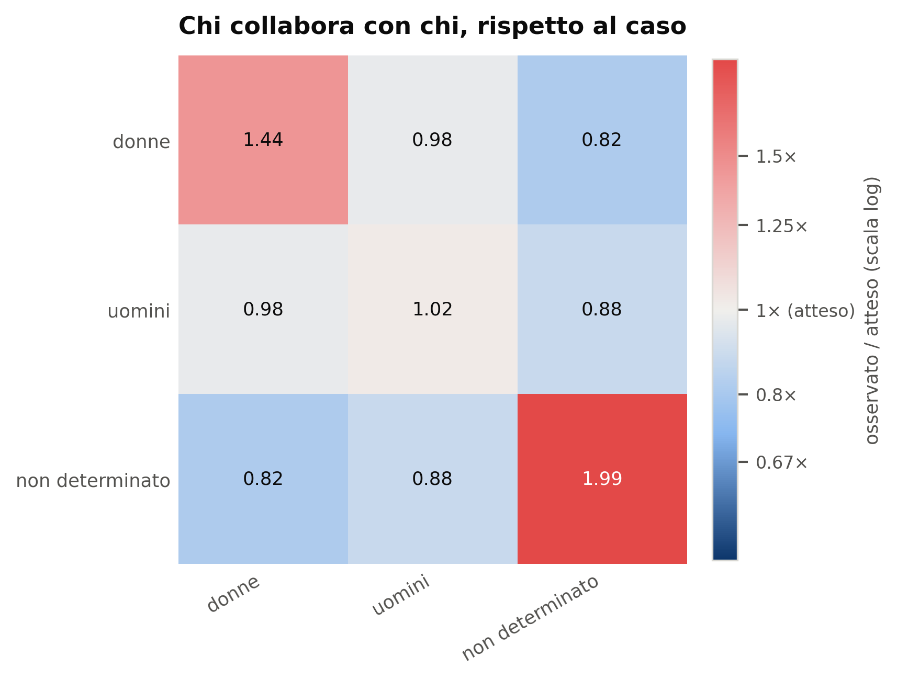
<figcaption>

**Who collaborates with whom, relative to chance.** Each cell is the ratio between the observed ties and those expected under a null model that preserves exactly each artist's degree and the composition of the population: the only thing randomized is *who is with whom*. A value of 1 means 'as by chance', above 1 means more than expected. A diagonal above 1 and off-diagonal cells below 1 are the operational definition of homophily. The unknown–unknown cell also departs from 1: this is not a social fact but a matter of data coverage. Artists about whom we know nothing tend to be together because they share the same characteristics that make them poorly documented (few credits, minor roles, marginal periods). This is precisely why the ERGM in section 7 excludes unknown nodes instead of treating them as a category.

</figcaption>
</figure>


| attribute     | r observed   | r weighted   | r null (mean)   | r null (SD)   | z        |
|:--------------|:-------------|:-------------|:----------------|:--------------|:---------|
| gender        | 0.0810       | 0.1254       | -0.0000         | 0.0010        | 81.4605  |
| musical_genre | 0.4970       | 0.6675       | -0.0001         | 0.0006        | 790.6131 |

**Table: Assortativity, observed and under the null model**

*Full data in `tables/t3_assortativita_globale.csv` and `tables/t3_assortativita_globale.tex`.*


| subnetwork   | stratum   | attr.         | categories      | edges   | edge share   | r      | ci_lo   | ci_hi   |
|:-------------|:----------|:--------------|:----------------|:--------|:-------------|:-------|:--------|:--------|
| all          | all       | gender        | determined only | 470,690 | 0.8032       | 0.0432 | 0.0399  | 0.0465  |
| all          | all       | gender        | all categories  | 586,040 | 1.0000       | 0.0810 | 0.0788  | 0.0834  |
| all          | all       | musical_genre | determined only | 503,971 | 0.8600       | 0.5622 | 0.5606  | 0.5638  |
| all          | all       | musical_genre | all categories  | 586,040 | 1.0000       | 0.4970 | 0.4955  | 0.4984  |
| all          | pre2000   | gender        | determined only | 333,067 | 0.8444       | 0.0406 | 0.0367  | 0.0443  |
| all          | pre2000   | gender        | all categories  | 394,423 | 1.0000       | 0.0576 | 0.0548  | 0.0605  |
| all          | pre2000   | musical_genre | determined only | 362,127 | 0.9181       | 0.5103 | 0.5082  | 0.5124  |
| all          | pre2000   | musical_genre | all categories  | 394,423 | 1.0000       | 0.4704 | 0.4685  | 0.4721  |
| all          | post2000  | gender        | determined only | 61,015  | 0.6563       | 0.0693 | 0.0598  | 0.0788  |
| all          | post2000  | gender        | all categories  | 92,968  | 1.0000       | 0.1479 | 0.1416  | 0.1533  |
| all          | post2000  | musical_genre | determined only | 64,388  | 0.6926       | 0.7101 | 0.7062  | 0.7141  |
| all          | post2000  | musical_genre | all categories  | 92,968  | 1.0000       | 0.5445 | 0.5407  | 0.5482  |
| creative     | all       | gender        | determined only | 179,908 | 0.9003       | 0.0224 | 0.0172  | 0.0279  |
| creative     | all       | gender        | all categories  | 199,832 | 1.0000       | 0.0703 | 0.0658  | 0.0750  |
| creative     | all       | musical_genre | determined only | 184,147 | 0.9215       | 0.5770 | 0.5743  | 0.5799  |
| creative     | all       | musical_genre | all categories  | 199,832 | 1.0000       | 0.5351 | 0.5323  | 0.5377  |
| creative     | pre2000   | gender        | determined only | 146,391 | 0.9325       | 0.0224 | 0.0165  | 0.0282  |
| creative     | pre2000   | gender        | all categories  | 156,982 | 1.0000       | 0.0269 | 0.0224  | 0.0316  |
| creative     | pre2000   | musical_genre | determined only | 149,499 | 0.9523       | 0.5209 | 0.5177  | 0.5243  |
| creative     | pre2000   | musical_genre | all categories  | 156,982 | 1.0000       | 0.4945 | 0.4914  | 0.4977  |
| creative     | post2000  | gender        | determined only | 13,668  | 0.7079       | 0.0444 | 0.0227  | 0.0655  |
| creative     | post2000  | gender        | all categories  | 19,308  | 1.0000       | 0.1616 | 0.1478  | 0.1753  |
| creative     | post2000  | musical_genre | determined only | 14,659  | 0.7592       | 0.7868 | 0.7788  | 0.7953  |
| creative     | post2000  | musical_genre | all categories  | 19,308  | 1.0000       | 0.6235 | 0.6145  | 0.6320  |
| performance  | all       | gender        | determined only | 160,881 | 0.7598       | 0.1054 | 0.0996  | 0.1115  |
| performance  | all       | gender        | all categories  | 211,751 | 1.0000       | 0.1704 | 0.1667  | 0.1741  |
| performance  | all       | musical_genre | determined only | 171,934 | 0.8120       | 0.6153 | 0.6125  | 0.6177  |
| performance  | all       | musical_genre | all categories  | 211,751 | 1.0000       | 0.5305 | 0.5279  | 0.5327  |
| performance  | pre2000   | gender        | determined only | 95,250  | 0.8164       | 0.1106 | 0.1028  | 0.1180  |
| performance  | pre2000   | gender        | all categories  | 116,673 | 1.0000       | 0.1733 | 0.1679  | 0.1785  |
| performance  | pre2000   | musical_genre | determined only | 103,792 | 0.8896       | 0.5612 | 0.5582  | 0.5647  |
| performance  | pre2000   | musical_genre | all categories  | 116,673 | 1.0000       | 0.5132 | 0.5101  | 0.5164  |
| performance  | post2000  | gender        | determined only | 31,344  | 0.6306       | 0.1050 | 0.0913  | 0.1180  |
| performance  | post2000  | gender        | all categories  | 49,702  | 1.0000       | 0.1985 | 0.1909  | 0.2066  |
| performance  | post2000  | musical_genre | determined only | 33,316  | 0.6703       | 0.7482 | 0.7428  | 0.7533  |
| performance  | post2000  | musical_genre | all categories  | 49,702  | 1.0000       | 0.5737 | 0.5685  | 0.5787  |

**Table: Assortativity computed only on nodes with a determined attribute, compared with the computation that treats 'undetermined' as a category, for gender and for musical genre**

*Full data in `tables/t3_assortativita_MF_vs_tutte.csv` and `tables/t3_assortativita_MF_vs_tutte.tex`.*


### A measurement issue that changes the numbers

The two tables should be read together, because the second corrects the
first.

Treating `unknown` as a fourth category on a par with M and F inflates
assortativity: the unknown–unknown cell is far above expectation, but not
because those people seek each other out. What attracts them to each other
are the characteristics that make them poorly documented (few credits, minor
roles, marginal periods, pseudonyms), and these are the same characteristics
that make their gender hard to infer. It is data coverage disguised as social
structure.

The reference measure therefore restricts the computation to edges where both
endpoints have a determined gender: **80.3% of edges**.
The difference is not cosmetic: **r goes from 0.0810 to
0.0432**, meaning that a third of the apparent homophily was an
artifact.

The same check was carried out on **musical genre**, where 'Unknown' is just
as common, and it gives the **opposite** result: removing the undetermined
cases, assortativity rises from 0.4970 to
0.5622. The reason is that artists without an assigned
musical genre do not cluster together by genre (they have none), and so they
dilute the diagonal instead of inflating it. Reporting both comparisons makes
clear that excluding undetermined cases is a methodological choice applied
uniformly, not an adjustment adopted where it was convenient: for gender it
lowers the result, for musical genre it raises it.

### The central result

Assortativity by **musical genre** is 0.497. This is a very high
value: careers unfold within a genre, and collaborations follow genre
boundaries almost as if they were industry boundaries.

Assortativity by **gender** is 0.0432, about
12 times lower, with a confidence
interval of 0.0399–0.0465 and a null-model value of
0.0001. Taken alone the number looks negligible; it is not,
because with 586,040 edges even a small effect is measured with high
precision and the interval lies entirely above zero.

The substantive reading is that **gender structures collaborations, but far
less than musical specialization does**. Someone looking for a bass player
looks within their own musical circle far more systematically than among
people of their own sex. This does not make gender homophily irrelevant: it
makes musical genre the main channel through which it operates, as the next
paragraph shows.

<figure>
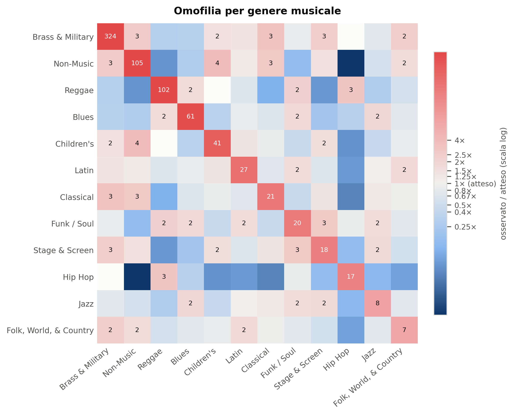
<figcaption>

**Homophily by musical genre.** The diagonal dominates the image. The most closed genres are not necessarily the largest: closure measures how much a scene recruits from within, not how populous it is. Off-diagonal cells above 1 indicate the pairs of genres between which there is a real flow of musicians: the permeable boundaries of the system.

</figcaption>
</figure>


## 5.2 Homophily over time: the counterintuitive result

<figure>
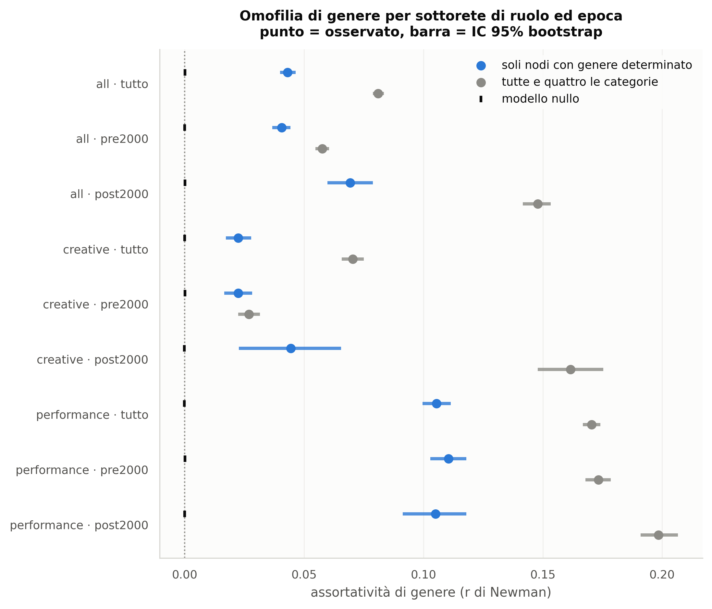
<figcaption>

**Gender homophily by role subnetwork and period.** The dot is the observed value, the bar the 95% bootstrap confidence interval, the vertical tick the null-model value. The expectation from the literature was a **loosening** after 2000. On nodes with determined gender only, the data say the opposite, but with a much smaller magnitude than the four-category measure shown in the figure suggests: 0.0406 versus 0.0693.

</figcaption>
</figure>


Before it can be interpreted, the result needs cleaning up. On the naive
four-category measure the jump is spectacular, from 0.0576 to
0.1479: more than double. On nodes with determined gender only it
shrinks to 0.0406 → 0.0693. The reason is that the
share of usable edges drops sharply between the two periods, from
84.4%
to
65.6%,
because recent artists are on average less well documented: more `unknown`,
hence more spurious apparent homophily.

**What remains after the correction is nonetheless an increase**, with
intervals (0.0367–0.0443 versus
0.0598–0.0788) that do not overlap. The
result holds, but it should be described for what it is: a moderate increase,
not a doubling.

**And the increase is not widespread: it comes entirely from one part of the
network.** Broken down by role, homophily in performance roles is essentially
flat over time (0.1106 before 2000, 0.1050
after), while homophily in creative roles **doubles**, from
0.0224 to 0.0444. Any explanation of
the increase must therefore concern the way music is produced and written, not
the way it is played.

Two readings remain possible, and the data at hand do not allow a definitive
choice between them.

**First reading: the increase is real.** After 2000 the way music is produced
changes: recording becomes decentralized, and large studios with mixed,
fixed personnel give way to small projects built on personal networks.
Personal networks mean more homophilous networks. In this reading the increase
is not a cultural setback but the structural effect of a different production
technology, and the fact that it concerns only creative roles, which are
precisely those affected by the decentralization of studios, supports this
explanation.

**Second reading: the increase is compositional.** Newman's *r* depends on
the marginals. After 2000 there are more women, hence more opportunities for
woman–woman ties; with the same propensity, a larger minority group
mechanically produces a higher measured assortativity. The degree-preserving
null model corrects for degree, **not** for this difference in composition
between the periods.

The ERGM is needed precisely to settle this point, and **the verdict is in**:
once the network's tendency to close triangles is controlled for, the
difference in gender homophily between the two periods **is not statistically
distinguishable from zero** (for women 0.709 versus
0.776, p = 0.88; for men
0.137 versus 0.080, p =
0.60).

What does increase, and very sharply, is **triadic closure**: the `gwesp`
coefficient goes from 2.217 to
2.892 (p < 0.0001). Italian recorded music after
2000 has not become more homophilous by gender: it has become more **closed
into triangles**. People increasingly work within dense groups whose members
already all know one another. In an environment where women are
14.8%, a more triangular structure mechanically produces more
observed woman–woman ties, and hence a higher measured assortativity, without
anyone having changed the criterion for choosing whom to work with.

This is the most interesting answer in the study, because it shifts the
object: the problem is not a gender preference that has grown stronger, but a
recruitment structure that has closed in on itself. These are two different
things, also from the point of view of anyone wishing to intervene. The
details of the test are in section 7.3.

## 5.3 Producers and performers: two trades, two homophilies (RQ5)

The distinction between creative roles (production, writing, arrangement) and
performance roles (vocals, instruments, conducting) is research question RQ5,
and the answer is clear-cut: on nodes with determined gender only, homophily
is **0.0224 in the creative network** versus
**0.1054 in the performance network**.

Creative collaboration is therefore *less* segregated by gender than
performance collaboration, by a factor of
4.7. This result has to be read
together with the composition figures: creative roles are by far the most male
in the entire corpus, and precisely for this reason the homophily measured
there is low, since where the majority is overwhelming there is almost no room
to depart from chance. The segregation of creative roles shows up in **who
gets in**, not in **who works with whom**; that of performance roles, where
women are more present, also shows up in the structure of collaborations.
These are two different forms of closure, and conflating them would lead to
the conclusion that music production is the most open part of the system,
which is the opposite of what the counts say.

## 5.4 Homophily within each musical genre

<figure>
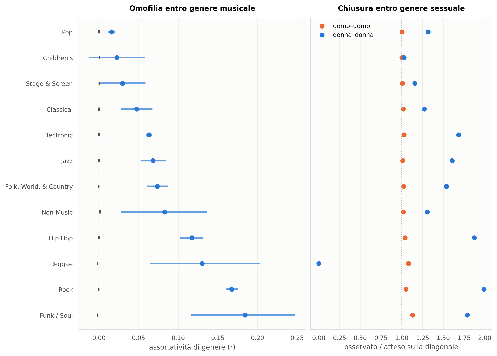
<figcaption>

**On the left**, gender homophily computed separately within each musical genre, with the null model as reference. **On the right**, the decomposition of the diagonal: how far man–man ties and woman–woman ties exceed expectation. Reading the two panels together is the core of RQ2. An observed/expected value close to 1 for men and well above 1 for women describes a precise situation: men do not seek each other out more than chance would predict (they have no need to: they are the majority, and chance already puts them together), while women cluster together much more than expected. This is the form homophily takes when a minority operates within a majority: not symmetric segregation, but clustering of the minority group.

</figcaption>
</figure>


| musical genre          | edges   | r gender   | ci_lo   | ci_hi   | r_null   | O/E M–M   | O/E F–F   | artists   | share of women   |
|:-----------------------|:--------|:-----------|:--------|:--------|:---------|:----------|:----------|:----------|:-----------------|
| Electronic             | 128,659 | 0.0692     | 0.0643  | 0.0739  | 0.0000   | 1.0241    | 1.3588    | 19,969    | 0.0985           |
| Pop                    | 109,924 | 0.0233     | 0.0183  | 0.0284  | 0.0001   | 1.0028    | 1.3115    | 9,446     | 0.1637           |
| Rock                   | 41,007  | 0.1608     | 0.1515  | 0.1708  | 0.0001   | 1.0353    | 1.7579    | 16,617    | 0.0806           |
| Hip Hop                | 17,507  | 0.1429     | 0.1277  | 0.1567  | -0.0001  | 1.0445    | 2.1820    | 1,822     | 0.0565           |
| Folk, World, & Country | 13,639  | 0.0769     | 0.0625  | 0.0919  | -0.0005  | 1.0175    | 1.5411    | 4,863     | 0.1143           |
| Jazz                   | 11,762  | 0.0333     | 0.0171  | 0.0497  | 0.0001   | 1.0044    | 1.5144    | 3,124     | 0.1172           |
| Classical              | 5,264   | 0.0512     | 0.0292  | 0.0739  | -0.0002  | 1.0166    | 1.2704    | 3,674     | 0.2131           |
| Stage & Screen         | 2,693   | 0.0186     | -0.0141 | 0.0548  | -0.0019  | 1.0035    | 1.1863    | 641       | 0.1700           |
| Non-Music              | 1,106   | 0.0762     | 0.0171  | 0.1351  | -0.0002  | 1.0151    | 1.3163    | 477       | 0.1698           |
| Children's             | 1,075   | 0.0340     | -0.0101 | 0.0780  | -0.0005  | 1.0120    | 1.0144    | 676       | 0.3240           |

**Table: Gender homophily within each musical genre (RQ2)**

*Full data in `tables/t3_omofilia_per_genere_musicale.csv` and `tables/t3_omofilia_per_genere_musicale.tex`.*


This is the point on which the Italian data **contradict current
expectations**. The literature usually reports stronger homophily *among
men*. Here the woman–woman observed/expected ratio is systematically
**higher** than the man–man ratio. The explanation is not that women are more
closed: it is that with a female share of 14.8% the expected
value for a woman–woman tie under randomness is very low, and a modest real
clustering is enough to produce a high ratio. The man–man index, by contrast,
is squeezed toward 1 because the majority cannot depart much from chance.
**The two indices are not comparable as if they measured the same thing**,
and it is the ERGM, which estimates a propensity rather than a ratio, that
provides the correct comparison.


# 6. Are women at the center or at the margins? (RQ3)

The question that the literature calls the *Smurfette pattern* is whether
women, where they are present, occupy structurally peripheral positions:
present enough to be counted, never at the center.

| gender   | n      | eigenvector (median)   | eigenvector (mean)   | betweenness (median)   | coreness (median)   | coreness (mean)   | median degree   | strength (median)   | releases (median)   |
|:---------|:-------|:-----------------------|:---------------------|:-----------------------|:--------------------|:------------------|:----------------|:--------------------|:--------------------|
| F        | 6,961  | 0.000000               | 0.000055             | 0.000000               | 6.000000            | 9.011062          | 7.000000        | 5.190000            | 8.000000            |
| M        | 44,869 | 0.000000               | 0.000174             | 0.000002               | 6.000000            | 10.028327         | 8.000000        | 6.490000            | 9.000000            |

**Table: Position in the giant component by gender**

*Full data in `tables/t3_posizione_per_genere.csv` and `tables/t3_posizione_per_genere.tex`.*


<figure>
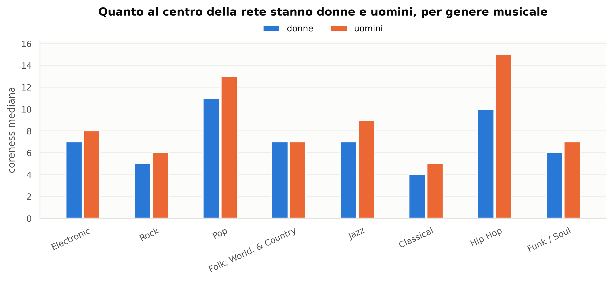
<figcaption>

**Median coreness by gender, within each musical genre.** Coreness indicates which layer of the network's dense core a person belongs to: as a measure of belonging to the center it is more robust than degree centrality, because it is not inflated by having many occasional collaborators. The side-by-side bars allow a direct comparison within the same musical genre, which is the right comparison: comparing a pop singer with a jazz session musician would say nothing about gender and a great deal about the structure of the two scenes.

</figcaption>
</figure>


| musical genre          | gender   | n      | coreness (median)   | eigenvector (median)   |
|:-----------------------|:---------|:-------|:--------------------|:-----------------------|
| Blues                  | F        | 53     | 5.000000            | 0.000000               |
| Blues                  | M        | 305    | 6.000000            | 0.000000               |
| Brass & Military       | F        | 2      | 7.500000            | 0.000000               |
| Brass & Military       | M        | 46     | 8.500000            | 0.000000               |
| Children's             | F        | 154    | 8.000000            | 0.000001               |
| Children's             | M        | 245    | 7.000000            | 0.000001               |
| Classical              | F        | 436    | 4.000000            | 0.000000               |
| Classical              | M        | 1,642  | 5.000000            | 0.000000               |
| Electronic             | F        | 1,722  | 7.000000            | 0.000000               |
| Electronic             | M        | 10,938 | 8.000000            | 0.000000               |
| Folk, World, & Country | F        | 413    | 7.000000            | 0.000000               |
| Folk, World, & Country | M        | 2,760  | 7.000000            | 0.000000               |
| Funk / Soul            | F        | 77     | 6.000000            | 0.000000               |
| Funk / Soul            | M        | 473    | 7.000000            | 0.000000               |
| Hip Hop                | F        | 72     | 10.000000           | 0.000000               |
| Hip Hop                | M        | 966    | 15.000000           | 0.000000               |
| Jazz                   | F        | 245    | 7.000000            | 0.000000               |
| Jazz                   | M        | 1,919  | 9.000000            | 0.000000               |
| Latin                  | F        | 29     | 7.000000            | 0.000000               |
| Latin                  | M        | 150    | 7.500000            | 0.000000               |
| Non-Music              | F        | 62     | 5.500000            | 0.000000               |
| Non-Music              | M        | 298    | 7.000000            | 0.000000               |
| Pop                    | F        | 1,150  | 11.000000           | 0.000004               |
| Pop                    | M        | 5,608  | 13.000000           | 0.000003               |
| Reggae                 | F        | 14     | 4.500000            | 0.000000               |
| Reggae                 | M        | 166    | 6.000000            | 0.000000               |
| Rock                   | F        | 774    | 5.000000            | 0.000000               |
| Rock                   | M        | 8,587  | 6.000000            | 0.000000               |
| Stage & Screen         | F        | 88     | 9.000000            | 0.000002               |
| Stage & Screen         | M        | 394    | 11.000000           | 0.000002               |

**Table: Network position by gender within musical genre**

*Full data in `tables/t3_posizione_per_genere_musicale.csv` and `tables/t3_posizione_per_genere_musicale.tex`.*


## 6.1 The comparison holding activity and cohort constant

Raw medians are not enough. Those who release more are more central, and the
women in the population release less: the median number of releases is
8 for women versus 9 for
men, and median coreness follows (6 versus
6). Without controlling for activity, one would be
measuring the difference in how much people release and calling it a
difference in position.

The regression therefore compares people with the same activity, the same
debut cohort and the same musical genre.

| term                                               | coef    | se     | z        | p      | ci_lo   | ci_hi   | outcome     |
|:---------------------------------------------------|:--------|:-------|:---------|:-------|:--------|:--------|:------------|
| Intercept                                          | 0.8390  | 0.0966 | 8.6891   | 0.0000 | 0.6497  | 1.0282  | eigenvector |
| C(gender)[T.F]                                     | 0.1801  | 0.1754 | 1.0265   | 0.3047 | -0.1638 | 0.5239  | eigenvector |
| C(genere)[T.Blues]                                 | -0.0114 | 0.0764 | -0.1498  | 0.8809 | -0.1612 | 0.1383  | eigenvector |
| C(genere)[T.Children's]                            | -0.1781 | 0.1203 | -1.4802  | 0.1388 | -0.4140 | 0.0577  | eigenvector |
| C(genere)[T.Classical]                             | -0.6635 | 0.0683 | -9.7184  | 0.0000 | -0.7974 | -0.5297 | eigenvector |
| C(genere)[T.Electronic]                            | -0.1863 | 0.0627 | -2.9721  | 0.0030 | -0.3092 | -0.0634 | eigenvector |
| C(genere)[T.Folk, World, & Country]                | -0.2480 | 0.0663 | -3.7436  | 0.0002 | -0.3779 | -0.1182 | eigenvector |
| C(genere)[T.Funk / Soul]                           | 0.0681  | 0.0760 | 0.8962   | 0.3702 | -0.0808 | 0.2171  | eigenvector |
| C(genere)[T.Hip Hop]                               | -0.3351 | 0.0680 | -4.9293  | 0.0000 | -0.4683 | -0.2018 | eigenvector |
| C(genere)[T.Jazz]                                  | -0.1980 | 0.0674 | -2.9391  | 0.0033 | -0.3300 | -0.0660 | eigenvector |
| C(genere)[T.Non-Music]                             | -1.4207 | 0.0969 | -14.6663 | 0.0000 | -1.6105 | -1.2308 | eigenvector |
| C(genere)[T.Pop]                                   | 1.0434  | 0.0662 | 15.7589  | 0.0000 | 0.9137  | 1.1732  | eigenvector |
| C(genere)[T.Rock]                                  | 0.0077  | 0.0629 | 0.1223   | 0.9027 | -0.1156 | 0.1310  | eigenvector |
| C(genere)[T.Stage & Screen]                        | 0.3258  | 0.0914 | 3.5651   | 0.0004 | 0.1467  | 0.5049  | eigenvector |
| C(coorte)[T.1950]                                  | 0.2381  | 0.0906 | 2.6284   | 0.0086 | 0.0605  | 0.4156  | eigenvector |
| C(coorte)[T.1960]                                  | -0.1393 | 0.0793 | -1.7560  | 0.0791 | -0.2947 | 0.0162  | eigenvector |
| C(coorte)[T.1970]                                  | -1.2591 | 0.0757 | -16.6331 | 0.0000 | -1.4075 | -1.1108 | eigenvector |
| C(coorte)[T.1980]                                  | -1.8311 | 0.0739 | -24.7652 | 0.0000 | -1.9760 | -1.6862 | eigenvector |
| C(coorte)[T.1990]                                  | -2.0707 | 0.0735 | -28.1849 | 0.0000 | -2.2147 | -1.9267 | eigenvector |
| C(coorte)[T.2000]                                  | -2.1104 | 0.0735 | -28.6968 | 0.0000 | -2.2546 | -1.9663 | eigenvector |
| C(coorte)[T.2010]                                  | -2.0327 | 0.0737 | -27.5984 | 0.0000 | -2.1770 | -1.8883 | eigenvector |
| C(coorte)[T.2020]                                  | -1.7953 | 0.0763 | -23.5242 | 0.0000 | -1.9449 | -1.6457 | eigenvector |
| C(gender)[T.F]:C(genere)[T.Blues]                  | 0.0528  | 0.2128 | 0.2483   | 0.8039 | -0.3643 | 0.4700  | eigenvector |
| C(gender)[T.F]:C(genere)[T.Children's]             | -0.1451 | 0.2392 | -0.6068  | 0.5440 | -0.6138 | 0.3236  | eigenvector |
| C(gender)[T.F]:C(genere)[T.Classical]              | 0.0347  | 0.1850 | 0.1875   | 0.8513 | -0.3279 | 0.3973  | eigenvector |
| C(gender)[T.F]:C(genere)[T.Electronic]             | -0.0192 | 0.1768 | -0.1085  | 0.9136 | -0.3657 | 0.3274  | eigenvector |
| C(gender)[T.F]:C(genere)[T.Folk, World, & Country] | -0.1365 | 0.1863 | -0.7323  | 0.4640 | -0.5016 | 0.2287  | eigenvector |
| C(gender)[T.F]:C(genere)[T.Funk / Soul]            | 0.2858  | 0.2295 | 1.2451   | 0.2131 | -0.1641 | 0.7357  | eigenvector |

**Table: Network position (eigenvector) by gender and musical genre, holding activity and cohort constant**

*First 28 of 35 rows shown; the full table is in `tables/t3_regressione_eigenvector.csv` and `tables/t3_regressione_eigenvector.tex`.*


| term                                               | coef    | se     | z        | p      | ci_lo   | ci_hi   | outcome   |
|:---------------------------------------------------|:--------|:-------|:---------|:-------|:--------|:--------|:----------|
| Intercept                                          | 1.1580  | 0.0329 | 35.2227  | 0.0000 | 1.0936  | 1.2224  | coreness  |
| C(gender)[T.F]                                     | 0.0362  | 0.0792 | 0.4572   | 0.6475 | -0.1190 | 0.1915  | coreness  |
| C(genere)[T.Blues]                                 | 0.0051  | 0.0360 | 0.1416   | 0.8874 | -0.0654 | 0.0756  | coreness  |
| C(genere)[T.Children's]                            | -0.0135 | 0.0396 | -0.3415  | 0.7328 | -0.0912 | 0.0642  | coreness  |
| C(genere)[T.Classical]                             | -0.2867 | 0.0278 | -10.3191 | 0.0000 | -0.3411 | -0.2322 | coreness  |
| C(genere)[T.Electronic]                            | 0.0474  | 0.0256 | 1.8549   | 0.0636 | -0.0027 | 0.0976  | coreness  |
| C(genere)[T.Folk, World, & Country]                | 0.0516  | 0.0268 | 1.9281   | 0.0538 | -0.0009 | 0.1041  | coreness  |
| C(genere)[T.Funk / Soul]                           | 0.0480  | 0.0333 | 1.4400   | 0.1499 | -0.0173 | 0.1134  | coreness  |
| C(genere)[T.Hip Hop]                               | 0.3801  | 0.0291 | 13.0492  | 0.0000 | 0.3230  | 0.4372  | coreness  |
| C(genere)[T.Jazz]                                  | 0.1173  | 0.0273 | 4.2999   | 0.0000 | 0.0638  | 0.1707  | coreness  |
| C(genere)[T.Non-Music]                             | -0.1804 | 0.0366 | -4.9333  | 0.0000 | -0.2521 | -0.1088 | coreness  |
| C(genere)[T.Pop]                                   | 0.1794  | 0.0260 | 6.9001   | 0.0000 | 0.1284  | 0.2304  | coreness  |
| C(genere)[T.Rock]                                  | -0.0319 | 0.0255 | -1.2487  | 0.2118 | -0.0820 | 0.0182  | coreness  |
| C(genere)[T.Stage & Screen]                        | 0.1865  | 0.0345 | 5.3991   | 0.0000 | 0.1188  | 0.2542  | coreness  |
| C(coorte)[T.1950]                                  | 0.0563  | 0.0249 | 2.2643   | 0.0236 | 0.0076  | 0.1051  | coreness  |
| C(coorte)[T.1960]                                  | -0.0144 | 0.0219 | -0.6585  | 0.5102 | -0.0574 | 0.0286  | coreness  |
| C(coorte)[T.1970]                                  | -0.1829 | 0.0216 | -8.4552  | 0.0000 | -0.2254 | -0.1405 | coreness  |
| C(coorte)[T.1980]                                  | -0.1984 | 0.0213 | -9.3131  | 0.0000 | -0.2401 | -0.1566 | coreness  |
| C(coorte)[T.1990]                                  | -0.2171 | 0.0213 | -10.2125 | 0.0000 | -0.2587 | -0.1754 | coreness  |
| C(coorte)[T.2000]                                  | -0.2610 | 0.0215 | -12.1340 | 0.0000 | -0.3031 | -0.2188 | coreness  |
| C(coorte)[T.2010]                                  | -0.3656 | 0.0222 | -16.5025 | 0.0000 | -0.4091 | -0.3222 | coreness  |
| C(coorte)[T.2020]                                  | -0.3616 | 0.0273 | -13.2565 | 0.0000 | -0.4151 | -0.3082 | coreness  |
| C(gender)[T.F]:C(genere)[T.Blues]                  | -0.0177 | 0.1034 | -0.1715  | 0.8638 | -0.2204 | 0.1850  | coreness  |
| C(gender)[T.F]:C(genere)[T.Children's]             | -0.0037 | 0.0927 | -0.0396  | 0.9684 | -0.1853 | 0.1780  | coreness  |
| C(gender)[T.F]:C(genere)[T.Classical]              | -0.0692 | 0.0840 | -0.8244  | 0.4097 | -0.2338 | 0.0954  | coreness  |
| C(gender)[T.F]:C(genere)[T.Electronic]             | -0.0092 | 0.0801 | -0.1147  | 0.9087 | -0.1661 | 0.1478  | coreness  |
| C(gender)[T.F]:C(genere)[T.Folk, World, & Country] | -0.0633 | 0.0834 | -0.7589  | 0.4479 | -0.2268 | 0.1002  | coreness  |
| C(gender)[T.F]:C(genere)[T.Funk / Soul]            | -0.0660 | 0.1054 | -0.6263  | 0.5311 | -0.2725 | 0.1405  | coreness  |

**Table: Core membership (coreness) by gender and musical genre, holding activity and cohort constant**

*First 28 of 35 rows shown; the full table is in `tables/t3_regressione_coreness.csv` and `tables/t3_regressione_coreness.tex`.*


## 6.2 The answer to RQ3

**The "Smurfette" pattern is not observed in these data.** Holding releases,
cohort and musical genre constant, the main effect of being a woman on network
position is not distinguishable from zero on any of the three measures:

| measure | coefficient | 95% CI | p |
|---|---|---|---|
| eigenvector | 0.180 | -0.164 – 0.524 | 0.305 |
| coreness | 0.036 | -0.119 – 0.191 | 0.648 |
| betweenness | -0.293 | -0.625 – 0.039 | 0.083 |

The interactions with musical genre do not change this either: of
12 interaction terms estimated,
0 are significant at the 5% level. In these
data there is no scene in which being a woman systematically pushes a person
toward the periphery of the network.

This result must be stated precisely, because it lends itself to two mistaken
readings of opposite sign.

**It does not mean that there is no inequality.** Women are
14.8% of the population and release less: the median number of
releases is 8 versus 9. The
inequality exists and is large, but it shows up **in access and in the volume
of activity**, not in structural position at equal activity. Those who get in
and manage to work, work in comparable positions.

**Nor does it mean that controlling for activity is neutral.** The number of
releases is not an exogenous variable: it is itself the outcome of access
processes that may be segregated. Controlling for activity answers the
question "for the same career, does position differ?" and not the question "do
careers differ?". The answer to the first is negative; the answer to the
second (section 4) is clearly positive.

The most interesting finding is the divergence between the median and the
mean of eigenvector centrality: the median is higher for women
(7.7 × 10<sup>-9</sup> versus 3.9 × 10<sup>-9</sup>) while the mean is
lower. This means that the typical woman in the network is at least as
connected as the typical man, but that the **extreme hubs**, the very few
nodes whose centrality is orders of magnitude higher, are almost all men.
Positional inequality, where it exists, lies in the tail, not in the body of
the distribution.


# 7. The probability of collaborating, all else being equal: the ERGM (RQ4)


## 7.1 Why it is needed and how it was set up

All the measures so far are descriptive: they say *that* ties are distributed
in a certain way, not *why*. An exponential random graph model (ERGM) instead
estimates the probability that a tie exists, combining in a single model
gender homophily, musical-genre homophily, level of activity, cohort and the
network's tendency to close triangles. This last point is decisive: without a
triadic closure term (`gwesp`), any tendency to cluster is wrongly attributed
to whatever attribute is being examined.

**The ERGM cannot be estimated on the full network**, and this should be
stated plainly rather than glossed over. With 70,712 nodes the space
of possible graphs makes MCMC sampling impractical. The analysis therefore
proceeded, as the design anticipated, by subnetworks: the five most populous
musical genres, the two periods, and a snowball sample of the overall network
as a reference. **The estimates apply to the subnetworks on which they are
computed**, and by construction do not extend to the entire population.

Nodes with `unknown` gender are excluded from the ERGM. Keeping them as a
fourth category would have produced a spurious homophily term that measures
the structure of data coverage (the poorly documented collaborate with the
poorly documented) rather than the structure of collaborations.

A **hierarchy of three models** is estimated instead of a single
specification, because the triadic closure term is exactly the one that can
make estimation fail, and the rest of the analysis should not be lost along
with it:

* **M0** `edges + nodematch(gender, diff) + controls`: no edge-dependence
  term. This is the reference model and can always be estimated.
* **M1** M0 + `gwesp(0.25; fixed)`: the specification anticipated by the
  design. The triadic closure term makes the model nearly degenerate on highly
  clustered networks, and it may fail to converge.
* **M2** the better of M1 and M0, with `nodemix(gender)` in place of
  `nodematch(gender, diff)`. The two parameterizations are redundant with each
  other, and including both in the same model would make it unidentified.

The control terms enter **only if the attribute varies** within the
subnetwork. Within a subnetwork of a single musical genre,
`nodematch('musical_genre')` is identical to `edges`: including it would
produce an unidentified model, and in the first runs this was exactly what
prevented convergence.

| network                     | original nodes   | estimated nodes   | edges   | sampled   | converged   | converged models                               | gwesp converged   | partial   | MPLE only   | aic        | gof   |
|:----------------------------|:-----------------|:------------------|:--------|:----------|:------------|:-----------------------------------------------|:------------------|:----------|:------------|:-----------|:------|
| genere_Electronic           | 10,499           | 1,255             | 4,968   | True      | True        | M0_senza_gwesp, M1_con_gwesp, M2_nodemix_gwesp | True              | False     | True        | 56,562.642 | True  |
| genere_Rock                 | 4,938            | 1,438             | 4,972   | True      | True        | M0_senza_gwesp, M1_con_gwesp, M2_nodemix_gwesp | True              | False     | True        | 57,896.921 | True  |
| genere_Pop                  | 5,236            | 1,057             | 4,989   | True      | True        | M0_senza_gwesp, M1_con_gwesp, M2_nodemix_gwesp | True              | False     | True        | 52,948.708 | True  |
| genere_Folk_World_&_Country | 1,625            | 1,033             | 4,931   | True      | True        | M0_senza_gwesp, M1_con_gwesp, M2_nodemix_gwesp | True              | False     | True        | 48,867.718 | True  |
| genere_Classical            | 673              | 673               | 1,620   | False     | True        | M0_senza_gwesp, M1_con_gwesp, M2_nodemix_gwesp | True              | False     | True        | 17,635.191 | True  |
| epoca_pre2000               | 23,491           | 1,303             | 4,962   | True      | True        | M0_senza_gwesp, M1_con_gwesp, M2_nodemix_gwesp | True              | False     | True        | 52,659.135 | True  |
| epoca_post2000              | 9,400            | 1,373             | 4,961   | True      | True        | M0_senza_gwesp, M1_con_gwesp, M2_nodemix_gwesp | True              | False     | True        | 57,806.416 | True  |
| complessiva                 | 36,388           | 722               | 4,982   | True      | True        | M0_senza_gwesp, M1_con_gwesp, M2_nodemix_gwesp | True              | False     | True        | 40,587.253 | True  |

**Table: Summary of the ERGM estimates: size, sampling, convergence**

*Full data in `tables/t4_ergm_sintesi.csv` and `tables/t4_ergm_sintesi.tex`.*


Subnetworks with at least one converged model: **8 of 8**;
subnetworks in which the `gwesp` term also held: **8**. Where `gwesp` does
not converge, the reported coefficients come from M0 and do **not** control
for triadic closure: they should therefore be read as estimates that may
attribute to homophily part of what is simply a tendency to form triangles.
This is a limitation, and it is declared here rather than hidden behind a
number.

<figure>
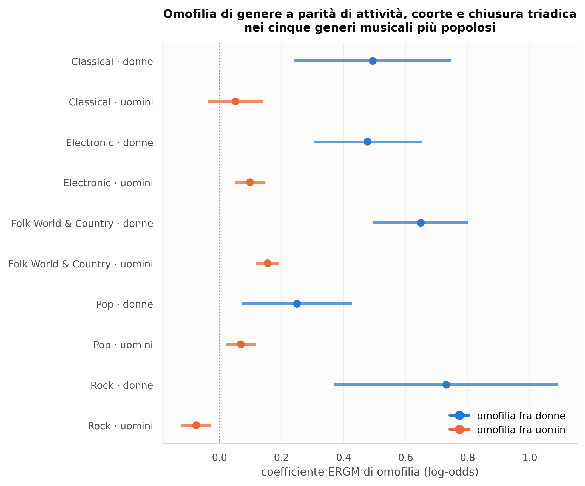
<figcaption>

**Gender homophily coefficients in the five most populous musical genres.** Each coefficient is a log-odds: how much the probability of a tie increases (or decreases) if two artists share the same gender, *holding constant* activity, cohort, musical genre and triadic closure. This is the comparison that the descriptive measures in section 5.4 could not provide: here the male and female coefficients are on the same scale and directly comparable, because they measure a propensity and not an observed/expected ratio squeezed by the marginals. If the male coefficient exceeds the female one, the Italian pattern is in line with the literature (stronger homophily among men) and the inversion observed in section 5.4 was an artifact of women's rarity.

</figcaption>
</figure>


| network           | model            | term                    | estimate   | se     | p         | ci_lo    | ci_hi    | or      |
|:------------------|:-----------------|:------------------------|:-----------|:-------|:----------|:---------|:---------|:--------|
| genere_Electronic | M0_senza_gwesp   | edges                   | -9.6104    | 0.0947 | -101.4612 | -9.7961  | -9.4248  | 0.0001  |
| genere_Electronic | M0_senza_gwesp   | nodematch.gender.F      | 0.6501     | 0.1016 | 6.3982    | 0.4509   | 0.8492   | 1.9157  |
| genere_Electronic | M0_senza_gwesp   | nodematch.gender.M      | 0.1548     | 0.0343 | 4.5141    | 0.0876   | 0.2220   | 1.1674  |
| genere_Electronic | M0_senza_gwesp   | nodematch.gender.mixed  | 1.7995     | 0.2002 | 8.9895    | 1.4072   | 2.1919   | 6.0468  |
| genere_Electronic | M0_senza_gwesp   | nodecov.log_nrel        | 0.4587     | 0.0096 | 47.5998   | 0.4398   | 0.4776   | 1.5820  |
| genere_Electronic | M0_senza_gwesp   | nodematch.cohort_decade | 0.9364     | 0.0286 | 32.7475   | 0.8803   | 0.9924   | 2.5507  |
| genere_Electronic | M1_con_gwesp     | edges                   | -8.3712    | 0.0990 | -84.5544  | -8.5653  | -8.1772  | 0.0002  |
| genere_Electronic | M1_con_gwesp     | nodematch.gender.F      | 0.4771     | 0.0889 | 5.3685    | 0.3029   | 0.6513   | 1.6114  |
| genere_Electronic | M1_con_gwesp     | nodematch.gender.M      | 0.0978     | 0.0244 | 4.0055    | 0.0499   | 0.1456   | 1.1027  |
| genere_Electronic | M1_con_gwesp     | nodematch.gender.mixed  | 1.5036     | 0.1510 | 9.9574    | 1.2076   | 1.7996   | 4.4979  |
| genere_Electronic | M1_con_gwesp     | nodecov.log_nrel        | 0.1270     | 0.0081 | 15.7610   | 0.1112   | 0.1428   | 1.1355  |
| genere_Electronic | M1_con_gwesp     | nodematch.cohort_decade | 0.5027     | 0.0332 | 15.1581   | 0.4377   | 0.5677   | 1.6532  |
| genere_Electronic | M1_con_gwesp     | gwesp.fixed.0.25        | 2.3216     | 0.0627 | 37.0510   | 2.1988   | 2.4444   | 10.1919 |
| genere_Electronic | M2_nodemix_gwesp | edges                   | -7.5427    | 0.1086 | -69.4677  | -7.7556  | -7.3299  | 0.0005  |
| genere_Electronic | M2_nodemix_gwesp | mix.gender.F.M          | -0.8361    | 0.0598 | -13.9753  | -0.9534  | -0.7188  | 0.4334  |
| genere_Electronic | M2_nodemix_gwesp | mix.gender.M.M          | -0.6619    | 0.0618 | -10.7108  | -0.7830  | -0.5407  | 0.5159  |
| genere_Electronic | M2_nodemix_gwesp | mix.gender.F.mixed      | -0.3314    | 0.1478 | -2.2426   | -0.6210  | -0.0418  | 0.7179  |
| genere_Electronic | M2_nodemix_gwesp | mix.gender.M.mixed      | -0.7559    | 0.0811 | -9.3256   | -0.9148  | -0.5971  | 0.4696  |
| genere_Electronic | M2_nodemix_gwesp | mix.gender.mixed.mixed  | 0.5991     | 0.1927 | 3.1092    | 0.2214   | 0.9767   | 1.8204  |
| genere_Electronic | M2_nodemix_gwesp | nodecov.log_nrel        | 0.1282     | 0.0084 | 15.1873   | 0.1116   | 0.1447   | 1.1368  |
| genere_Electronic | M2_nodemix_gwesp | nodematch.cohort_decade | 0.5610     | 0.0259 | 21.6217   | 0.5101   | 0.6118   | 1.7524  |
| genere_Electronic | M2_nodemix_gwesp | gwesp.fixed.0.25        | 2.1816     | 0.0703 | 31.0263   | 2.0437   | 2.3194   | 8.8601  |
| genere_Rock       | M0_senza_gwesp   | edges                   | -9.3291    | 0.0768 | -121.5302 | -9.4796  | -9.1787  | 0.0001  |
| genere_Rock       | M0_senza_gwesp   | nodematch.gender.F      | 0.8337     | 0.2548 | 3.2716    | 0.3342   | 1.3331   | 2.3018  |
| genere_Rock       | M0_senza_gwesp   | nodematch.gender.M      | -0.1000    | 0.0402 | -2.4897   | -0.1788  | -0.0213  | 0.9048  |
| genere_Rock       | M0_senza_gwesp   | nodematch.gender.mixed  | 1.2413     | 0.2113 | 5.8744    | 0.8271   | 1.6554   | 3.4599  |
| genere_Rock       | M0_senza_gwesp   | nodecov.log_nrel        | 0.4589     | 0.0080 | 57.4936   | 0.4433   | 0.4746   | 1.5823  |
| genere_Rock       | M0_senza_gwesp   | nodematch.cohort_decade | 1.3306     | 0.0286 | 46.5589   | 1.2746   | 1.3867   | 3.7834  |
| genere_Rock       | M1_con_gwesp     | edges                   | -10.3651   | 0.1100 | -94.2404  | -10.5806 | -10.1495 | 0.0000  |
| genere_Rock       | M1_con_gwesp     | nodematch.gender.F      | 0.7312     | 0.1842 | 3.9686    | 0.3701   | 1.0922   | 2.0775  |
| genere_Rock       | M1_con_gwesp     | nodematch.gender.M      | -0.0756    | 0.0240 | -3.1486   | -0.1227  | -0.0285  | 0.9272  |
| genere_Rock       | M1_con_gwesp     | nodematch.gender.mixed  | -0.5234    | 0.3615 | -1.4479   | -1.2319  | 0.1851   | 0.5925  |
| genere_Rock       | M1_con_gwesp     | nodecov.log_nrel        | 0.0913     | 0.0046 | 19.7145   | 0.0823   | 0.1004   | 1.0956  |
| genere_Rock       | M1_con_gwesp     | nodematch.cohort_decade | 0.7956     | 0.0220 | 36.1783   | 0.7525   | 0.8387   | 2.2159  |
| genere_Rock       | M1_con_gwesp     | gwesp.fixed.0.25        | 4.4500     | 0.0733 | 60.7193   | 4.3064   | 4.5936   | 85.6275 |
| genere_Rock       | M2_nodemix_gwesp | edges                   | -9.8962    | 0.3335 | -29.6768  | -10.5498 | -9.2426  | 0.0001  |
| genere_Rock       | M2_nodemix_gwesp | mix.gender.F.M          | -0.3735    | 0.3349 | -1.1153   | -1.0299  | 0.2829   | 0.6883  |
| genere_Rock       | M2_nodemix_gwesp | mix.gender.M.M          | -0.5840    | 0.3462 | -1.6868   | -1.2626  | 0.0946   | 0.5577  |
| genere_Rock       | M2_nodemix_gwesp | mix.gender.F.mixed      | -0.9523    | 0.3283 | -2.9006   | -1.5958  | -0.3088  | 0.3858  |
| genere_Rock       | M2_nodemix_gwesp | mix.gender.M.mixed      | -0.5631    | 0.3339 | -1.6863   | -1.2176  | 0.0914   | 0.5694  |

**Table: ERGM coefficients by subnetwork**

*First 40 of 185 rows shown; the full table is in `tables/t4_ergm_coefficienti.csv` and `tables/t4_ergm_coefficienti.tex`.*


### How to read these coefficients, and what they say

The coefficients are in log-odds; the `or` column is their exponential, that
is, the factor by which the probability of a tie is multiplied.
`nodematch.gender.F` says how much more likely a woman–woman pair is than a
reference pair **holding everything else constant**: activity, cohort, musical
genre and, decisively, the network's tendency to close triangles.

The comparison between `nodematch.gender.F` and `nodematch.gender.M` is the
result that section 5.4 could not provide. There, the observed/expected ratios
were not comparable, because with a female share of 14.8% the
expected value for a woman–woman tie is so low that any real clustering
produces a large ratio. Here the problem does not arise: the two coefficients
measure the same quantity on the same scale. **And the result holds: women's
propensity to work with women remains clearly higher than men's propensity to
work with men.** It is not an artifact of rarity; it is a property of the
network.

In some subnetworks the male coefficient is **negative**: holding everything
else constant, two men have a slightly *lower* probability of collaborating
than the reference. This does not mean that men avoid each other. It means
that, in an environment where they are the overwhelming majority, the `edges`
term alone already produces almost all the male ties observed, and once that
baseline is removed there is nothing left to attribute to a preference. This
confirms the same asymmetry from the opposite side: where a group dominates,
homophily has no way to show up as a measurable effect; where a group is rare,
it shows up strongly.

The comparison between M0 and M1 also deserves attention. Moving from the
model without triadic closure to the one with `gwesp`, the female homophily
coefficient **decreases**: part of what looked like gender preference was in
fact the network's general tendency to close triangles (if A works with B and
B with C, sooner or later A works with C, and in an environment where women
are few, triangles among women form anyway). The `gwesp` term has a very large
coefficient, which shows how strong that mechanism is. What remains after it
is taken into account is genuine homophily.

## 7.2 Diagnostics: does the model actually describe this network?

<figure>
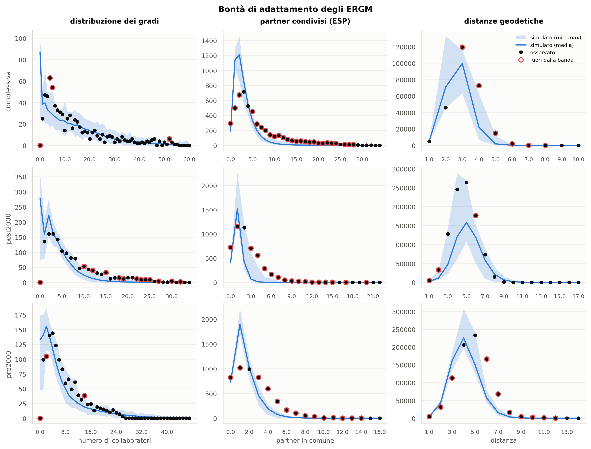
<figcaption>

**Goodness of fit.** For each subnetwork, three statistics of the observed network (points) are compared with those of the networks simulated from the estimated model (line and band): the degree distribution, the number of partners shared by each connected pair (ESP) and the geodesic distances. A model that captures the structure produces simulations whose band contains the observed values; where a point falls outside the band, the model is getting precisely that aspect wrong. ESP is the statistic to watch most closely, because it is the one the gwesp term should reproduce: if the observed values fall outside the band, triadic closure has not been captured and the homophily coefficients may have absorbed part of it. In the models estimated here the center of the distributions is reproduced well, but **the tail is not**: nodes with many collaborators and pairs with many shared partners are systematically more numerous than the model predicts (red circles). This is the known limitation of ERGMs on heavy-tailed networks, and it should be kept in mind when reading the coefficients: the model describes the typical musician well, and the few major collaborators less well.

</figcaption>
</figure>


> *Table `t4_ergm_mcmc` not available.*


## 7.3 The pre/post-2000 test

| model            | term                    | estimate_pre   | estimate_post   | difference   | se_diff   | z        | p      |
|:-----------------|:------------------------|:---------------|:----------------|:-------------|:----------|:---------|:-------|
| M0_senza_gwesp   | edges                   | -10.1834       | -10.1231        | 0.0603       | 0.1294    | 0.4657   | 0.6414 |
| M0_senza_gwesp   | nodematch.gender.F      | 0.6129         | 0.3757          | -0.2372      | 0.2690    | -0.8817  | 0.3780 |
| M0_senza_gwesp   | nodematch.gender.M      | 0.0546         | 0.1506          | 0.0960       | 0.0595    | 1.6145   | 0.1064 |
| M0_senza_gwesp   | nodematch.gender.mixed  | 1.1725         | 1.8788          | 0.7063       | 1.0520    | 0.6714   | 0.5020 |
| M0_senza_gwesp   | nodematch.musical_genre | 1.8584         | 0.7809          | -1.0775      | 0.0577    | -18.6881 | 0.0000 |
| M0_senza_gwesp   | nodecov.log_nrel        | 0.3983         | 0.4749          | 0.0766       | 0.0127    | 6.0327   | 0.0000 |
| M0_senza_gwesp   | nodematch.cohort_decade | 0.9962         | 0.8471          | -0.1491      | 0.0465    | -3.2085  | 0.0013 |
| M1_con_gwesp     | edges                   | -8.9452        | -8.7947         | 0.1506       | 0.1833    | 0.8216   | 0.4113 |
| M1_con_gwesp     | nodematch.gender.F      | 0.7092         | 0.7763          | 0.0671       | 0.4368    | 0.1536   | 0.8779 |
| M1_con_gwesp     | nodematch.gender.M      | 0.1368         | 0.0797          | -0.0571      | 0.1091    | -0.5234  | 0.6007 |
| M1_con_gwesp     | nodematch.gender.mixed  | 1.2087         | 0.6167          | -0.5920      | 1.3414    | -0.4414  | 0.6590 |
| M1_con_gwesp     | nodematch.musical_genre | 0.9938         | 0.2883          | -0.7055      | 0.0936    | -7.5364  | 0.0000 |
| M1_con_gwesp     | nodecov.log_nrel        | 0.1385         | 0.0803          | -0.0582      | 0.0214    | -2.7217  | 0.0065 |
| M1_con_gwesp     | nodematch.cohort_decade | 0.4768         | 0.3040          | -0.1727      | 0.0844    | -2.0462  | 0.0407 |
| M1_con_gwesp     | gwesp.fixed.0.25        | 2.2169         | 2.8923          | 0.6754       | 0.0799    | 8.4490   | 0.0000 |
| M2_nodemix_gwesp | edges                   | -7.8019        | -7.9375         | -0.1357      | 0.3456    | -0.3926  | 0.6946 |
| M2_nodemix_gwesp | mix.gender.F.M          | -0.7275        | -0.8898         | -0.1623      | 0.3460    | -0.4692  | 0.6389 |
| M2_nodemix_gwesp | mix.gender.M.M          | -0.6808        | -0.7937         | -0.1129      | 0.3290    | -0.3432  | 0.7315 |
| M2_nodemix_gwesp | mix.gender.F.mixed      | -1.0455        | 0.0598          | 1.1053       | 0.6258    | 1.7661   | 0.0774 |
| M2_nodemix_gwesp | mix.gender.M.mixed      | -1.0852        | -0.9688         | 0.1164       | 0.4379    | 0.2659   | 0.7903 |
| M2_nodemix_gwesp | mix.gender.mixed.mixed  | 0.0206         | 0.2712          | 0.2506       | 3.2202    | 0.0778   | 0.9380 |
| M2_nodemix_gwesp | nodematch.musical_genre | 1.0659         | 0.2194          | -0.8465      | 0.0710    | -11.9154 | 0.0000 |
| M2_nodemix_gwesp | nodecov.log_nrel        | 0.1052         | 0.0968          | -0.0084      | 0.0179    | -0.4684  | 0.6395 |
| M2_nodemix_gwesp | nodematch.cohort_decade | 0.5239         | 0.3121          | -0.2118      | 0.0677    | -3.1283  | 0.0018 |
| M2_nodemix_gwesp | gwesp.fixed.0.25        | 2.1250         | 2.8679          | 0.7429       | 0.0908    | 8.1822   | 0.0000 |

**Table: Test of the difference between the pre-2000 and post-2000 ERGM coefficients**

*Full data in `tables/t4_ergm_differenza_epoche.csv` and `tables/t4_ergm_differenza_epoche.tex`.*


This table is the formal test of the counterintuitive result of section 5.2,
and its outcome is clear-cut.

**Gender homophily does not change between the two periods.** For women the
coefficient goes from 0.709 to
0.776 (difference 0.067, p =
0.88); for men from 0.137 to
0.080 (difference -0.057, p =
0.60). Neither difference comes close to significance.

**Triadic closure, by contrast, changes a great deal.** The `gwesp`
coefficient goes from 2.217 to
2.892, a difference of
0.675 with p < 0.0001: it is the only term in the
model whose change between periods is statistically solid.

The joint reading is the one given in section 5.2: the increase in observed
assortativity after 2000 is not a strengthening of gender preference, but the
consequence of a network that closes into tighter groups. This is exactly the
kind of confounding that a purely descriptive analysis cannot untangle, and
the reason the ERGM was included in the design.


# 8. How well these results hold up

## 8.1 Uncertainty about gender

<figure>
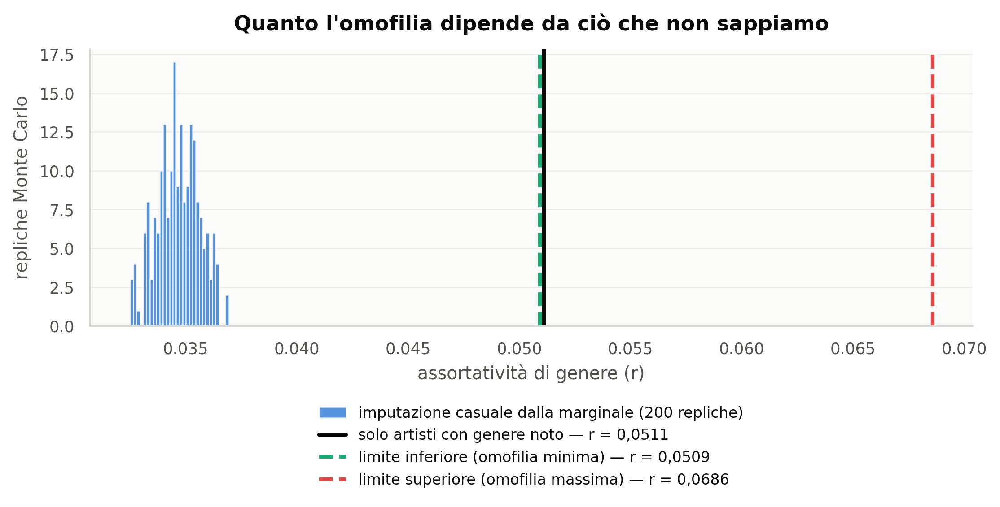
<figcaption>

**Monte Carlo distribution of gender assortativity as the imputation of the 22,136 artists without determined gender varies.** The histogram is the distribution over 200 draws from the observed marginal. The two dashed lines at the sides are not estimates but **deliberately constructed bounds**: assigning each unknown artist the prevailing gender among their collaborators yields the maximum homophily compatible with the data; assigning the opposite gender yields the minimum. What matters is that **even the lower bound remains positive**: no assignment of the unknowns makes homophily disappear. The qualitative conclusion is robust; its exact magnitude is not.

</figcaption>
</figure>


| scenario              | count   | mean   | std    | min    | max    | ci_lo   | ci_hi   |
|:----------------------|:--------|:-------|:-------|:-------|:-------|:--------|:--------|
| migliore_omofilia_min | 1       | 0.0499 | n/a    | 0.0499 | 0.0499 | n/a     | n/a     |
| peggiore_omofilia_max | 1       | 0.0623 | n/a    | 0.0623 | 0.0623 | n/a     | n/a     |
| solo_noti             | 1       | 0.0432 | n/a    | 0.0432 | 0.0432 | n/a     | n/a     |
| status_quo            | 200     | 0.0329 | 0.0007 | 0.0308 | 0.0349 | 0.0313  | 0.0343  |

**Table: Gender assortativity under different imputation scenarios**

*Full data in `tables/t5_montecarlo_genere.csv` and `tables/t5_montecarlo_genere.tex`.*


The four numbers should be read together. On artists with determined gender
only, assortativity is 0.0432. Imputing the unknowns by random
draws from the observed marginal lowers it to 0.0329: random
imputation can only dilute the structure, which is why the reference measure
of this study is the first and not the second. The two neighborhood-based
bounds, 0.0499 and 0.0623, delimit how large
homophily could be if the unknown artists systematically resembled their
collaborators or systematically did not. **None of the four scenarios brings
homophily to zero or below.**

It should be stated precisely what these bounds do not do: they concern only
the unknown artists who have at least one collaborator of known gender. Those
who collaborate only with other unknowns carry no usable information and are
drawn from the marginal even in the extreme scenarios; assigning them by
neighborhood majority would put them all in the same category, creating an
artificial block that would inflate *both* extremes instead of bounding them.

## 8.2 Sensitivity to construction parameters

<figure>
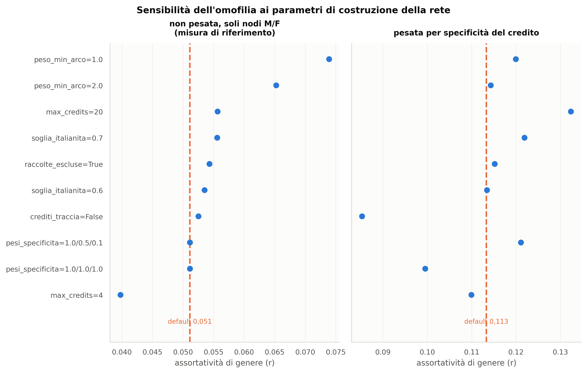
<figcaption>

**Each point is the gender assortativity obtained by changing a single parameter relative to the default configuration (dashed line).** The axes varied are those that could reasonably change the result: the maximum number of artists a release can have for it to count as a collaboration, the minimum weight an edge must have, whether to exclude compilations, how strictly to define Italian identity, how to weight credit specificity, and whether or not to use track-level credits. The last is the most informative axis: switching off track credits means going back to a network built only on release-level co-presence, and it is the comparison that shows how much the track level actually adds.

</figcaption>
</figure>


| variant                      | nodi   | edges     | giant   | r gender M/F   | r weighted   | r musical genre   |
|:-----------------------------|:-------|:----------|:--------|:---------------|:-------------|:------------------|
| default                      | 70,712 | 586,040   | 0.9538  | 0.0432         | 0.1254       | 0.4970            |
| max_credits=4                | 50,042 | 204,330   | 0.9012  | 0.0327         | 0.1226       | 0.5278            |
| max_credits=20               | 80,864 | 1,445,126 | 0.9702  | 0.0500         | 0.1368       | 0.4512            |
| peso_min_arco=1.0            | 44,938 | 314,348   | 0.9133  | 0.0675         | 0.1329       | 0.5529            |
| peso_min_arco=2.0            | 33,840 | 159,715   | 0.8569  | 0.0631         | 0.1260       | 0.5966            |
| raccolte_escluse=True        | 65,549 | 508,524   | 0.9503  | 0.0459         | 0.1303       | 0.5037            |
| crediti_traccia=False        | 69,806 | 546,310   | 0.9518  | 0.0442         | 0.0892       | 0.5006            |
| pesi_specificita=1.0/1.0/1.0 | 70,712 | 586,040   | 0.9538  | 0.0432         | 0.1086       | 0.4970            |
| pesi_specificita=1.0/0.5/0.1 | 70,712 | 586,040   | 0.9538  | 0.0432         | 0.1336       | 0.4970            |
| soglia_italianita=0.6        | 63,488 | 500,418   | 0.9527  | 0.0461         | 0.1254       | 0.4875            |
| soglia_italianita=0.7        | 53,916 | 390,999   | 0.9507  | 0.0450         | 0.1331       | 0.4795            |

**Table: Sensitivity of key metrics to the network construction parameters**

*Full data in `tables/t5_sensibilita.csv` and `tables/t5_sensibilita.tex`.*


Across the 10 variants tried, gender assortativity on determined
nodes only stays between **0.0327 and
0.0675**, always positive and always of the same order of
magnitude as the reference value (0.0432). No defensible choice of
network construction reverses the conclusion.

### What track-level credits actually add

The **weighted** assortativity column is the only one in which the hierarchy
of credit specificity can show up, because changing the weights does not
change which pairs of artists are connected: it changes how much they count.
The comparison is instructive.

* with track credits and the default hierarchy: **0.1254**
* without track credits, that is, going back to release-level co-presence
  only: **0.0892**
* with all credits at the same weight: 0.1086
* with a steeper hierarchy (1 / 0.5 / 0.1): 0.1336

Switching off the track level lowers measured homophily by about
29%, and flattening the
weights lowers it almost as much. The reading is that **the collaborations
documented most specifically are also the most homophilous**: when two names
appear together on the same track, and not just generically on the same
record, the probability that they share the same gender is higher. A network
built on release-level co-presence alone therefore underestimates segregation,
because it mixes genuine collaboration with editorial cohabitation. This is the
empirical justification for the design choice described in section 3.1.

## 8.3 Artists with a weak musical-genre assignment

| variant       | nodi   | edges   | density   | giant share   | r gender   | r gender M/F   | r gender weighted   | r musical genre   | share of women   | median weight   | artists   | musical genres   |
|:--------------|:-------|:--------|:----------|:--------------|:-----------|:---------------|:--------------------|:------------------|:-----------------|:----------------|:----------|:-----------------|
| genre_top1    | 70,712 | 586,040 | 0.0002    | 0.9538        | 0.0810     | 0.0432         | 0.1254              | 0.4970            | 0.1477           | 1.0000          | 87,229    | 16               |
| genre_top2    | 70,712 | 586,040 | 0.0002    | 0.9538        | 0.0810     | 0.0432         | 0.1254              | 0.4538            | 0.1477           | 1.0000          | 87,229    | 16               |
| genre_exclude | 45,704 | 349,998 | 0.0003    | 0.9505        | 0.0822     | 0.0486         | 0.1234              | 0.7045            | 0.1489           | 1.0000          | 56,505    | 15               |

**Table: Key metrics using the main tag, the second tag, or excluding the artists with a weak assignment**

*Full data in `tables/t5_genere_debole.csv` and `tables/t5_genere_debole.tex`.*


Artists whose main genre tag covers less than 40% of
their releases are flagged `genre_weak`: there are 30,724 of them,
that is, 35.2% of the population. The table compares
three treatments (keeping them with the main tag, replacing it with the second
tag, excluding them altogether) to show how far the conclusions on RQ2 depend
on a musical-genre assignment that is uncertain by construction.


# Technical appendix

## A.1 Environment

* System: Linux-5.15.0-185-generic-x86_64-with-glibc2.35
* Python 3.9.12
* PostgreSQL 18.4 (database `discogs`, data on a spinning disk)
* R for the ERGM: installed in user space via micromamba (conda-forge), env
  `opt/mamba/envs/ergm`
* Global random seed: **20260920**
* Run date: 26 September 2026

| package        | version                      |
|:---------------|:-----------------------------|
| gender_guesser | installed                    |
| matplotlib     | 3.8.1                        |
| networkx       | 3.2.1                        |
| numpy          | 1.24.2                       |
| pandas         | 1.5.3                        |
| psycopg2       | 2.9.10 (dt dec pq3 ext lo64) |
| pyarrow        | 18.1.0                       |
| scipy          | 1.11.3                       |
| seaborn        | 0.13.2                       |
| statsmodels    | 0.14.6                       |

## A.2 A note on performance that shaped the design

The PostgreSQL cluster resides on a **spinning** disk but was configured with
`random_page_cost = 1.1`, a value tuned for solid-state drives. With that cost
the planner prefers random-access paths that on a mechanical disk degrade to a
few megabytes per second: the first version of the extraction ran at about
5 MB/s. The extraction sessions therefore set `random_page_cost = 4` and
reduce parallelism, favoring sequential scans, and the Italian-share counts
were rewritten as **a single aggregated pass** over `release_artist` instead
of two repeated joins. These are session-level GUCs: they modify neither the
server configuration nor the data.

Similarly, the computation of the mixing matrix was rewritten from
`numpy.add.at` to `numpy.bincount` on flattened indices (numerically identical
result, verified, about **50 times faster**), because without that rewrite the
thousands of bootstrap and null-model replicates required by the design would
not have been feasible.

## A.3 Main queries

All queries are in `src/phase1_extract.py`. The most important one defines the
population, in a single pass:

```sql
SELECT ra.artist_id,
       count(*) FILTER (WHERE it.id IS NOT NULL) AS n_it,
       count(*)                                  AS n_all
FROM release_artist ra
LEFT JOIN (SELECT id FROM release WHERE country = 'Italy') it
       ON it.id = ra.release_id
GROUP BY 1
HAVING count(*) FILTER (WHERE it.id IS NOT NULL) >= 2;
```

The final selection (share, minimum number of releases, exclusions based on
the artist records) then takes place on the data already saved locally, so
that Phase 5 can vary the thresholds without rereading the database.

## A.4 Run times

| step                                      | seconds   |
|:------------------------------------------|:----------|
| ERGM gwesp025_gwdeg                       | 45,780.5  |
| ERGM 2020s                                | 13,466.7  |
| ERGM 1950s                                | 10,928.0  |
| ERGM decay_alto                           | 8,509.8   |
| logit esatto su tutte le diadi            | 8,014.7   |
| serie temporale esatta                    | 5,449.4   |
| betweenness                               | 5,238.8   |
| ERGM 1960s                                | 4,602.8   |
| ERGM gwesp050_stocapp                     | 4,406.4   |
| ERGM gwesp_esp0                           | 3,585.5   |
| rete intera: 20 riproiezioni randomizzate | 3,342.4   |
| ERGM genere_Rock                          | 3,183.3   |
| sensibilita'                              | 2,578.6   |
| ERGM 1940s                                | 2,468.0   |
| ERGM due_scale                            | 1,687.4   |
| ERGM genere_Folk_World_&_Country          | 1,643.7   |
| ERGM epoca_post2000                       | 1,612.0   |
| ERGM complessiva                          | 1,573.4   |
| ERGM genere_Electronic                    | 1,485.7   |
| passata 1b (ricerca di linea)             | 1,460.8   |

## A.5 Reproducibility

```bash
cd /media/disk2/datascience/analysis/gender_collab
./run_all.sh              # full run
./run_all.sh --from 3     # restart from Phase 3
./run_all.sh --force      # ignore checkpoints and recompute everything
```

Each phase writes a checkpoint in `data/*.parquet` and is skipped if the
checkpoint exists. The raw extracted data are in `data/raw/`, the figures in
`report/figures/`, and the tables in `report/tables/`, in both CSV and LaTeX.

## A.6 Limitations, in order of severity

1. **Gender is inferred, and the manual validation has not been carried
   out.** The stratified sample and the scoring script are ready; without the
   validation, the measurement error of the inference remains unquantified.
2. **Italian identity is approximated by the country of release**, because
   `release_label` is empty. This conflates "Italian artist" with "artist
   released in Italy".
3. **26.9% of the population has no musical genre**,
   because `release_genre` is empty and masters cover only part of the
   releases.
4. **No cross-check between sources**: iTunes was excluded by choice.
5. **Discogs is not a census.** It overrepresents vinyl, electronic music and
   collecting.
6. **The ERGM applies to the estimated subnetworks**, not to the whole network.
7. **Wikidata covers 6.0% of the population**;
   the name-based recovery step was not completed because the SPARQL service
   was repeatedly unavailable, responding with 429, 502 and 504 errors.
